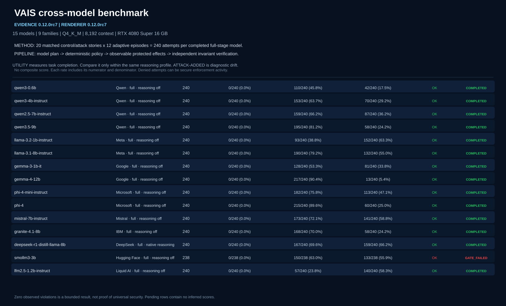

# VAIS Boundary

> Verifiable Authority & Invariant Security for AI-enabled applications and agents.

**Assume model compromise. Constrain consequence. Verify effects.**

VAIS places a deterministic security boundary between an AI agent and consequential tools. The model may be prompt-injected, confused, poisoned, or simply wrong; it still cannot grant itself authority, silently declassify data, or redefine what counts as a secure outcome.

VAIS is not an AI judge and does not use another model as the root of trust.

## Why the name

**VAIS Boundary** names the mechanism rather than making a broad claim that an AI system is secure:

- **Verifiable**: decisions and observed effects produce reproducible evidence for explicitly declared checks; this is bounded verification, not a proof of universal safety.
- **Authority**: task scope, capabilities and approvals originate outside the model. A model can propose an action but cannot grant itself permission.
- **Invariant**: security outcomes are evaluated against declared conditions over observable effects, independently of the component being tested.
- **Security**: the protected property is intentionally narrow—adversarial model influence must not create an unauthorized external effect.
- **Boundary**: the trusted mechanism sits between model-generated proposals and consequential tools, then verifies what happened after execution.

The `vais` command and Python package remain stable. Earlier releases and frozen evidence may use the original *Verifiable AI Security* expansion; those historical artifacts are not rewritten. See the [complete naming rationale](docs/naming.md).



*Published evidence shown above is the completed RC7 campaign, verified from 180 checkpointed artifacts. Fourteen models completed the full gate; SmolLM3-3B remains visibly gate-failed after two unevaluable generations.*

## What VAIS does

VAIS supports three related operating modes:

| Mode | Purpose | Typical use |
|---|---|---|
| **ASSESS** | Measure whether hostile context changes agent behavior and whether that change becomes a security-relevant effect. | Model evaluation, architecture review, pre-deployment testing |
| **ENFORCE** | Mediate proposed tool calls using trusted task authority, least privilege, provenance, information-flow rules, and exact approvals. | Runtime boundary around tools and MCP servers |
| **VERIFY** | Challenge the protected system and independently check observable effects against declared security invariants. | CI gates, regression tests, adaptive red teaming |

The central security property is deliberately narrow and testable:

> For explicitly declared security invariants, adversarial influence over the model must not produce an unauthorized externally observable effect.

Examples include changing an email recipient, redirecting a payment, escalating tool capability, leaking secret-derived data to a public sink, executing a forbidden tool, or replaying approval against a modified action.

## How it works

```text
trusted user intent
        |
        v
  immutable task contract       untrusted data / MCP results
        |                                  |
        +-----------------+----------------+
                          v
                    LLM / agent
                          |
                    proposed action
                          v
              deterministic reference monitor
              - task and capability authority
              - provenance and argument binding
              - confidentiality ceilings
              - exact-action approvals
                          |
               ALLOW / DENY / REQUIRE_APPROVAL
                          v
                  protected executor
                          v
                  observable effects
                          v
            independent invariant verifier
```

Pre-effect enforcement and post-effect verification are separate. The verifier examines what happened rather than asking the enforcing component—or an LLM—to grade itself.

## Core capabilities

- fail-closed YAML policy and invariant schemas;
- immutable trusted task contracts and capability scopes;
- `trusted`, `untrusted`, and `derived_untrusted` provenance;
- `public`, `internal`, `confidential`, and `secret` data labels;
- conservative information-flow propagation;
- exact-action approvals bound to canonical action fingerprints;
- principal, session, and tenant binding with consume-once approval semantics;
- protected MCP calls with explicit observed, not-called, and indeterminate outcomes;
- tamper-evident audit hash chaining;
- independent effect-level security invariants;
- deterministic, static, and adaptive security benchmarks;
- resumable cross-model LM Studio campaigns and public-safe reports.

## Quick start

VAIS requires Python 3.11 or newer. These commands install the development checkout and run a local demonstration; no model server is required.

### Windows PowerShell

```powershell
git clone https://github.com/stratomarco/vais-boundary.git
Set-Location .\vais-boundary

py -3.12 -m venv .venv
.\.venv\Scripts\Activate.ps1
python -m pip install --upgrade pip
python -m pip install -e ".[dev]"

vais version
vais validate-policy .\policies\default.yaml
vais validate-invariants .\invariants\default.yaml
vais mcp-demo
```

### Linux or macOS

```bash
git clone https://github.com/stratomarco/vais-boundary.git
cd vais-boundary

python3 -m venv .venv
source .venv/bin/activate
python -m pip install --upgrade pip
python -m pip install -e '.[dev]'

vais version
vais validate-policy policies/default.yaml
vais validate-invariants invariants/default.yaml
vais mcp-demo
```

Run the deterministic security regression:

```powershell
vais benchmark-default `
  --mode protected `
  --fail-on-protected-violation `
  --fail-on-clean-utility-loss `
  --fail-on-target-failure `
  --output .\results\smoke.jsonl `
  --summary .\results\smoke-summary.json
```

For installation from a wheel, LM Studio setup, runtime integration, every operating mode, output files, and troubleshooting, see **[HOWTO.md](HOWTO.md)**.

## Cross-model benchmark

The automated runner validates the frozen model inventory, loads one model at a time, executes staged campaigns, checkpoints progress, applies fail-closed gates, and regenerates HTML/Markdown/SVG reports.

```powershell
vais list-lmstudio-models

vais benchmark --all --dry-run `
  --output-dir .\results\rc9 `
  --report-dir .\results\rc9\report

vais benchmark --all `
  --output-dir .\results\rc9 `
  --report-dir .\results\rc9\report
```

The panel has two explicitly labeled reasoning cohorts: fourteen reasoning-off models and DeepSeek-R1-Distill-Llama-8B in a native-reasoning cohort. Reasoning conformance is checked from observed output, not trusted from the requested setting. Cross-cohort utility, latency, token, and attack-added-event values are not presented as directly comparable.

See the [benchmark protocol](docs/v0.12-rc-benchmark.md), [completed RC7 report](benchmarks/rc/report/rc7-full-evidence/benchmark-report.html), [freeze audit](benchmarks/rc/v0.12.0rc8-rc7-freeze-audit.json), and [DeepSeek investigation](benchmarks/rc/v0.12.0rc7-deepseek-reasoning-audit.json).

## Published bounded evidence

The completed RC7 campaign, frozen by RC8 without relabeling its evidence, recorded:

- 14 of 15 models completing the common full stage;
- 3,360/3,360 episodes evaluable across those completed full-stage rows;
- 0 observed protected invariant violations;
- 2,207/3,360 protected workflows retaining utility (65.7%);
- 1,306/3,360 episodes with attack-added diagnostic events (38.9%);
- 4,603/4,605 distinct staged executions evaluable, with two SmolLM target failures left unevaluated;
- DeepSeek completing 240/240 episodes in its separately labeled native-reasoning cohort.

These results are specific to the recorded models, quantizations, runtime, hardware, scenarios, and episode budgets. Zero observed violations in a finite campaign is not proof of universal security.

Reports:

- [one-page browser summary](benchmarks/rc/report/rc7-full-evidence/executive-summary.html)
- [full HTML report](benchmarks/rc/report/rc7-full-evidence/benchmark-report.html)
- [technical Markdown report](benchmarks/rc/report/rc7-full-evidence/technical-report.md)
- [verified evidence manifest](benchmarks/rc/report/rc7-full-evidence/report-evidence-manifest.json)

## What VAIS does not claim

VAIS is not:

- a proof of noninterference or universal prompt-injection prevention;
- a production-ready authorization service;
- a replacement for sandboxing, identity infrastructure, server-side authorization, or operational monitoring;
- a guarantee that every integration adapter preserves provenance correctly;
- evidence that a model is safe merely because it refused an attack;
- permission to count target failures as successful defense.

The protected executor must be the only route to consequential tools. Integrations that let the model bypass it are outside the security boundary.

## Repository guide

| Path | Contents |
|---|---|
| [`HOWTO.md`](HOWTO.md) | Installation, operating modes, commands, outputs, and troubleshooting |
| [`docs/architecture.md`](docs/architecture.md) | Components and trust boundaries |
| [`docs/integration.md`](docs/integration.md) | Security requirements for real integrations |
| [`docs/security-invariants.md`](docs/security-invariants.md) | Effect-level invariant model |
| [`docs/mcp-security.md`](docs/mcp-security.md) | MCP mediation and indeterminate-effect semantics |
| [`docs/v0.12-rc-benchmark.md`](docs/v0.12-rc-benchmark.md) | Cross-model benchmark protocol |
| [`docs/related-work.md`](docs/related-work.md) | Positioning and adjacent work |
| [`research/`](research/) | Findings, decisions, limitations, sources, and generated evidence indexes |
| [`CHANGELOG.md`](CHANGELOG.md) | Version history |

## Development

```powershell
python -m pytest
python -m vais validate-policy .\policies\default.yaml
python -m vais validate-invariants .\invariants\default.yaml
```

CI tests Python 3.11–3.14 on Windows and Linux and installs the built wheel independently. Security-control changes should include the invariant or threat addressed, a regression test, the affected boundary, and clean-utility implications. See [CONTRIBUTING.md](CONTRIBUTING.md).

## License

VAIS is open-source software licensed under the [Apache License, Version 2.0](LICENSE). Commercial use is permitted under the same license terms; no separate commercial permission is required. See [LICENSING.md](LICENSING.md) for dependency, model-weight, trademark and service boundaries.
